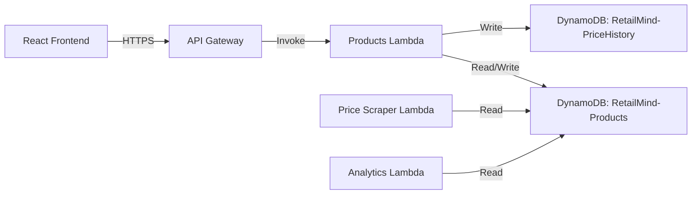
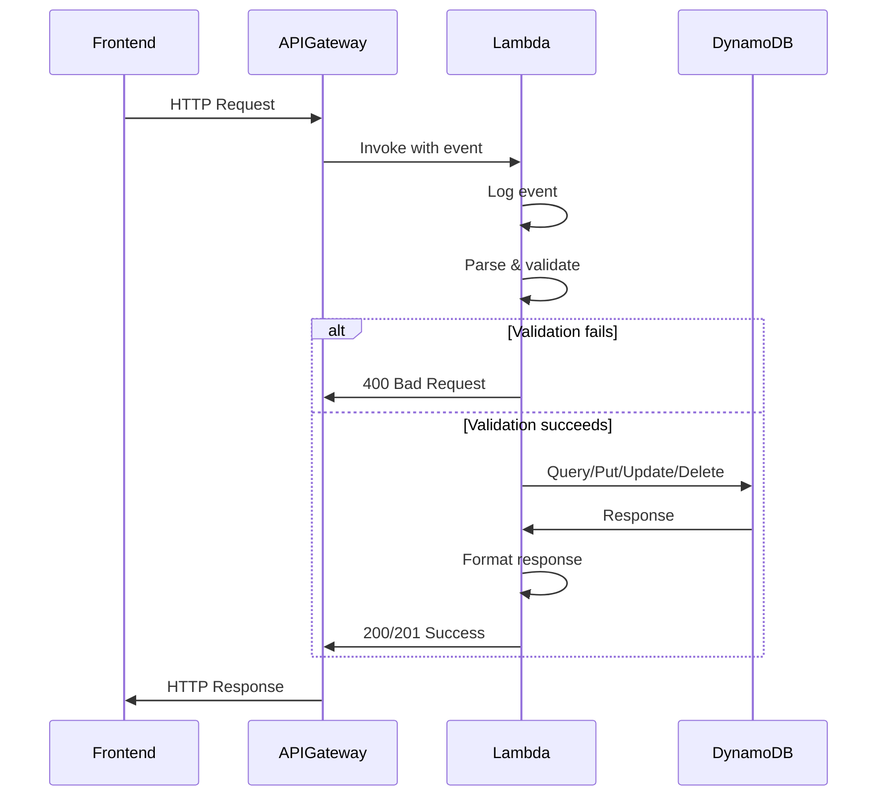

# Design Document: Products Lambda

## Overview

The Products Lambda function is a serverless REST API handler that provides complete CRUD (Create, Read, Update, Delete) operations for the RetailMind AI product catalog. Built on AWS Lambda with Node.js/ESM, it integrates with Amazon DynamoDB for data persistence and exposes endpoints through Amazon API Gateway.

This function serves as the foundational data service for the RetailMind AI platform, enabling retailers to manage their product inventory, track pricing changes, and maintain competitor URLs for price monitoring. The design prioritizes simplicity, reliability, and consistency with existing Lambda patterns in the codebase.

**Key Design Goals:**
- Minimal, focused implementation suitable for hackathon demo
- Consistent error handling and logging patterns
- Proper validation and business rule enforcement
- CORS-enabled responses for frontend integration
- Efficient DynamoDB operations with connection reuse

## Architecture

### System Context



### Component Architecture

The Products Lambda follows a simple three-layer architecture:

1. **Handler Layer** (`index.mjs`): Routes HTTP requests to appropriate operation handlers
2. **Business Logic Layer**: Validates input, enforces business rules, and orchestrates data operations
3. **Data Access Layer**: Interacts with DynamoDB using AWS SDK v3

### Request Flow



## Components and Interfaces

### Lambda Handler

**File:** `backend/functions/products/index.mjs`

**Exports:**
- `handler(event)` - Main Lambda entry point

**Responsibilities:**
- Route requests based on HTTP method and path
- Coordinate request/response flow
- Ensure consistent error handling
- Add CORS headers to all responses

### Operation Handlers

**createProduct(body)**
- Validates product data
- Generates unique product ID (UUID v4)
- Checks SKU uniqueness
- Inserts record into DynamoDB
- Returns 201 with created product

**getAllProducts(queryParams)**
- Retrieves active products from DynamoDB
- Applies category and search filters
- Implements pagination
- Sorts by creation timestamp (descending)
- Returns 200 with product array and pagination metadata

**getProductById(productId)**
- Retrieves single product by ID
- Checks if product exists and is active
- Returns 200 with product details or 404 if not found

**updateProduct(productId, body)**
- Validates update data
- Checks product exists
- Records price change in price history if price updated
- Updates product with new data and timestamp
- Returns 200 with updated product

**deleteProduct(productId)**
- Performs soft delete (sets isActive: false)
- Updates lastModified timestamp
- Preserves all data for analytics
- Returns 200 with confirmation message

### Validation Functions

**validateProductData(data, isUpdate = false)**
- Validates required fields (name, sku, currentPrice, cost, stockQuantity)
- Checks field lengths and formats
- Validates numeric constraints (price > 0, cost >= 0, stock >= 0)
- Validates price >= cost
- Validates competitor URLs if provided
- Returns validation result with error messages

**validateSKUUniqueness(sku, excludeProductId = null)**
- Queries DynamoDB for existing SKU
- Excludes current product ID for updates
- Returns boolean indicating uniqueness

### DynamoDB Client

**Initialization:**
```javascript
import { DynamoDBClient } from "@aws-sdk/client-dynamodb";
import { DynamoDBDocumentClient, PutCommand, GetCommand, 
         QueryCommand, UpdateCommand, ScanCommand } from "@aws-sdk/lib-dynamodb";

const dynamodb = DynamoDBDocumentClient.from(
  new DynamoDBClient({ region: "us-east-1" })
);
```

**Connection Reuse:** Client instance created at module level for Lambda container reuse.

### API Gateway Integration

**Endpoints:**
- `POST /products` - Create product
- `GET /products` - List products (with optional query params: category, search, page, pageSize)
- `GET /products/{id}` - Get product details
- `PUT /products/{id}` - Update product
- `DELETE /products/{id}` - Delete product

**Event Structure:**
```javascript
{
  httpMethod: "GET" | "POST" | "PUT" | "DELETE",
  path: "/products" | "/products/{id}",
  pathParameters: { id: "uuid" },
  queryStringParameters: { category, search, page, pageSize },
  body: "JSON string"
}
```

**Response Structure:**
```javascript
{
  statusCode: 200 | 201 | 400 | 404 | 500,
  headers: {
    "Content-Type": "application/json",
    "Access-Control-Allow-Origin": "*"
  },
  body: "JSON string"
}
```

## Data Models

### Product Schema (DynamoDB)

**Table Name:** `RetailMind-Products`

**Primary Key:** `id` (String, UUID v4)

**Attributes:**
```javascript
{
  id: "uuid-v4",                    // Partition key
  name: "string",                   // 1-200 characters
  sku: "string",                    // 1-100 characters, unique
  category: "string",               // 1-50 characters
  currentPrice: number,             // > 0, max 2 decimal places
  cost: number,                     // >= 0, max 2 decimal places
  stockQuantity: number,            // >= 0, integer
  competitorUrls: [                 // Optional array
    {
      competitor: "string",
      url: "string"                 // Valid HTTP/HTTPS URL
    }
  ],
  isActive: boolean,                // Default: true
  createdAt: "ISO 8601 timestamp",
  lastModified: "ISO 8601 timestamp"
}
```

**Indexes:**
- Primary: `id` (partition key)
- GSI (future): `sku-index` for SKU lookups
- GSI (future): `category-index` for category filtering

### Price History Schema (DynamoDB)

**Table Name:** `RetailMind-PriceHistory`

**Primary Key:** Composite
- Partition key: `productId` (String)
- Sort key: `timestamp` (Number, Unix timestamp)

**Attributes:**
```javascript
{
  productId: "uuid-v4",
  timestamp: number,                // Unix timestamp
  oldPrice: number,
  newPrice: number,
  changedBy: "string",              // "system" or user ID
  reason: "string",                 // Optional change reason
  recordedAt: "ISO 8601 timestamp"
}
```

### API Request/Response Models

**Create Product Request:**
```javascript
{
  name: "string",                   // Required
  sku: "string",                    // Required
  category: "string",               // Required
  currentPrice: number,             // Required
  cost: number,                     // Required
  stockQuantity: number,            // Required
  competitorUrls: [                 // Optional
    {
      competitor: "string",
      url: "string"
    }
  ]
}
```

**Update Product Request:**
```javascript
{
  name: "string",                   // Optional
  category: "string",               // Optional
  currentPrice: number,             // Optional
  cost: number,                     // Optional
  stockQuantity: number,            // Optional
  competitorUrls: [...]             // Optional
}
```

**Product Response:**
```javascript
{
  id: "uuid",
  name: "string",
  sku: "string",
  category: "string",
  currentPrice: number,
  cost: number,
  stockQuantity: number,
  competitorUrls: [...],
  isActive: boolean,
  createdAt: "ISO 8601",
  lastModified: "ISO 8601"
}
```

**List Products Response:**
```javascript
{
  products: [Product],
  pagination: {
    totalCount: number,
    pageSize: number,
    currentPage: number,
    totalPages: number
  }
}
```

**Error Response:**
```javascript
{
  error: "string",                  // User-friendly message
  details: "string"                 // Optional additional context
}
```

### Validation Rules

**Field Constraints:**
- `name`: 1-200 characters, non-empty
- `sku`: 1-100 characters, unique across active products
- `category`: 1-50 characters
- `currentPrice`: > 0, max 2 decimal places
- `cost`: >= 0, max 2 decimal places, <= currentPrice
- `stockQuantity`: >= 0, integer
- `competitorUrls[].url`: Valid HTTP/HTTPS URL format

**Business Rules:**
- Price must be greater than cost (prevents loss)
- SKU must be unique within active products
- Soft delete preserves data (isActive flag)
- Price changes trigger price history record
- All timestamps in ISO 8601 format


## Correctness Properties

*A property is a characteristic or behavior that should hold true across all valid executions of a system—essentially, a formal statement about what the system should do. Properties serve as the bridge between human-readable specifications and machine-verifiable correctness guarantees.*

### Property Reflection

After analyzing all acceptance criteria, I identified several areas of redundancy:

**Consolidated Validation Properties:**
- Properties 1.3, 1.5, 1.6, 1.7 (create validation) and 4.2, 4.3, 4.4 (update validation) test the same validation rules → Combined into comprehensive validation properties
- Properties 8.1-8.6 (field-level validation) overlap with basic validation → Integrated into validation properties with specific constraints

**Consolidated Response Properties:**
- Properties 1.11, 2.9, 3.8, 4.11, 5.7, 7.3 all test CORS headers → Single property for all responses
- Properties 7.1, 7.2 test JSON format → Single property for response format
- Properties 1.9, 2.8, 3.5, 4.8, 5.5 test status codes → Consolidated into operation-specific properties

**Consolidated Error Handling:**
- Properties 3.6, 4.9, 5.6 all test 404 for missing products → Single property
- Properties 1.10, 4.10 test 400 for validation failures → Single property
- Properties 6.2, 6.3 test 500 error handling → Combined into error handling property

**Consolidated Metadata Properties:**
- Properties 4.7, 5.4 test lastModified updates → Single property for all mutations
- Properties 2.6, 7.7 test pagination metadata → Single comprehensive pagination property

This reflection reduces ~60 testable criteria to ~25 unique, non-redundant properties.

### Property 1: Product Creation Round Trip

*For any* valid product data (name, sku, category, currentPrice, cost, stockQuantity), creating a product and then retrieving it by ID should return a product with the same data plus generated fields (id, createdAt, lastModified, isActive).

**Validates: Requirements 1.1, 1.2, 1.8, 3.1**

### Property 2: Required Field Validation

*For any* product creation or update request, if any required field (name, sku for create; or any updated field) is missing, empty, or invalid (empty string, null, undefined, whitespace-only for strings), the operation should return HTTP 400 with a descriptive error message.

**Validates: Requirements 1.3, 1.10, 4.10**

### Property 3: Numeric Constraint Validation

*For any* product creation or update request, if currentPrice <= 0, cost < 0, or stockQuantity < 0, the operation should return HTTP 400 with a descriptive error message indicating which constraint was violated.

**Validates: Requirements 1.5, 1.6, 1.7, 4.2, 4.3, 4.4**

### Property 4: SKU Uniqueness Constraint

*For any* two product creation requests with the same SKU value, the second creation should return HTTP 400 with an error message indicating the SKU already exists.

**Validates: Requirements 1.4**

### Property 5: Price-Cost Business Rule

*For any* product creation or update request where currentPrice < cost, the operation should return HTTP 400 with an error message indicating potential loss.

**Validates: Requirements 4.5, 8.8**

### Property 6: Field Length Validation

*For any* product creation or update request, if name length is not in [1, 200], sku length is not in [1, 100], or category length is not in [1, 50], the operation should return HTTP 400 with a descriptive error message.

**Validates: Requirements 8.1, 8.2, 8.3**

### Property 7: Decimal Precision Validation

*For any* product creation or update request, if currentPrice or cost has more than 2 decimal places, the operation should either reject with HTTP 400 or round to 2 decimal places.

**Validates: Requirements 8.4**

### Property 8: Integer Stock Validation

*For any* product creation or update request, if stockQuantity is not an integer, the operation should return HTTP 400 with an error message.

**Validates: Requirements 8.5**

### Property 9: URL Format Validation

*For any* product creation or update request with competitorUrls, if any URL is not a valid HTTP or HTTPS URL, the operation should return HTTP 400 with an error message.

**Validates: Requirements 8.6**

### Property 10: Successful Creation Response

*For any* valid product creation request, the response should have HTTP status 201, include all required fields (id, name, sku, category, currentPrice, cost, stockQuantity, createdAt, lastModified, isActive), and the id should be a valid UUID v4.

**Validates: Requirements 1.9, 7.4**

### Property 11: Product List Retrieval

*For any* set of created active products, a GET /products request should return HTTP 200 with an array containing all active products, excluding any soft-deleted products (isActive: false).

**Validates: Requirements 2.1, 2.8, 2.10**

### Property 12: Product List Ordering

*For any* set of created products with different creation timestamps, a GET /products request should return products sorted in descending order by createdAt timestamp (newest first).

**Validates: Requirements 2.2**

### Property 13: Category Filtering

*For any* set of products in multiple categories, a GET /products?category=X request should return only products where category equals X.

**Validates: Requirements 2.3**

### Property 14: Name Search Filtering

*For any* set of products with various names, a GET /products?search=term request should return only products where the name contains the search term (case-insensitive).

**Validates: Requirements 2.4**

### Property 15: Pagination Limits

*For any* GET /products request with pageSize parameter, if pageSize > 100, the response should return at most 100 items.

**Validates: Requirements 2.5, 9.4**

### Property 16: Pagination Metadata

*For any* GET /products request with pagination parameters (page, pageSize), the response should include pagination metadata with correct values for totalCount, pageSize, currentPage, and totalPages where totalPages = ceil(totalCount / pageSize).

**Validates: Requirements 2.6, 7.7**

### Property 17: Product Update Round Trip

*For any* existing product and valid update data, updating the product and then retrieving it should return the product with updated fields, unchanged id and createdAt, and a newer lastModified timestamp.

**Validates: Requirements 4.1, 4.7, 4.8, 4.12**

### Property 18: Price Change History Recording

*For any* product update where currentPrice changes from oldPrice to newPrice, a record should be created in the RetailMind-PriceHistory table with productId, timestamp, oldPrice, and newPrice.

**Validates: Requirements 4.6**

### Property 19: Soft Delete Behavior

*For any* existing product, a DELETE /products/{id} request should set isActive to false, preserve all other product data, update lastModified, and return HTTP 200 with a confirmation message.

**Validates: Requirements 5.1, 5.2, 5.3, 5.4, 5.5**

### Property 20: Not Found Error Handling

*For any* non-existent product ID, GET /products/{id}, PUT /products/{id}, or DELETE /products/{id} requests should return HTTP 404 with an error message.

**Validates: Requirements 3.6, 4.9, 5.6**

### Property 21: Soft-Deleted Product Inaccessibility

*For any* soft-deleted product (isActive: false), a GET /products/{id} request should return HTTP 404 with an error message, treating it as if it doesn't exist.

**Validates: Requirements 3.7**

### Property 22: CORS Headers on All Responses

*For any* request to the Products Lambda (regardless of success or failure), the response should include the header "Access-Control-Allow-Origin: *".

**Validates: Requirements 1.11, 2.9, 3.8, 4.11, 5.7, 7.3**

### Property 23: JSON Response Format

*For any* request to the Products Lambda, the response should have "Content-Type: application/json" header and a body that is valid JSON.

**Validates: Requirements 7.1, 7.2**

### Property 24: Error Response Format

*For any* request that results in an error (4xx or 5xx status), the response body should include an "error" field with a descriptive message, and should not include sensitive data like stack traces or internal implementation details.

**Validates: Requirements 7.5, 6.7**

### Property 25: Database Error Handling

*For any* DynamoDB operation failure or unexpected error, the Lambda should log the error details (including stack trace) and return HTTP 500 with a generic error message.

**Validates: Requirements 6.2, 6.3**

### Property 26: Operation Logging

*For any* Lambda invocation, the function should log the complete event object at entry, and log all successful operations with relevant product IDs.

**Validates: Requirements 6.1, 6.4**

### Property 27: Validation Error Logging

*For any* validation failure, the Lambda should log the validation failure details including which field failed and why.

**Validates: Requirements 6.6**

### Property 28: Request Correlation Tracing

*For any* Lambda invocation, if the event contains a requestId or correlation ID, it should be included in all log statements for that request.

**Validates: Requirements 6.5**

### Property 29: Optional Field Inclusion

*For any* product with competitorUrls, priceHistory, or competitorPrices data, retrieving the product should include these optional fields in the response when they exist.

**Validates: Requirements 7.6, 2.7, 3.3, 3.4**

### Property 30: Complete Product Attributes

*For any* product retrieval (single or list), the response should include all product attributes stored in DynamoDB.

**Validates: Requirements 3.2**

## Error Handling

### Error Categories

**Validation Errors (HTTP 400):**
- Missing or empty required fields
- Invalid field formats (non-numeric prices, invalid URLs)
- Constraint violations (price <= 0, negative stock)
- Business rule violations (price < cost)
- Duplicate SKU
- Field length violations

**Not Found Errors (HTTP 404):**
- Product ID does not exist
- Product is soft-deleted (isActive: false)

**Server Errors (HTTP 500):**
- DynamoDB operation failures
- Unexpected runtime errors
- Unhandled exceptions

### Error Response Structure

All error responses follow this format:
```javascript
{
  error: "User-friendly error message",
  details: "Optional additional context" // Only for 400 errors
}
```

### Error Handling Strategy

1. **Input Validation:** Validate all inputs before database operations
2. **Try-Catch Blocks:** Wrap all DynamoDB operations in try-catch
3. **Logging:** Log all errors with full details (stack traces for 500 errors)
4. **Sanitization:** Never expose internal errors, stack traces, or database details to clients
5. **Correlation:** Include request IDs in logs for tracing
6. **Graceful Degradation:** Return generic 500 errors for unexpected failures

### Logging Strategy

**Entry Logging:**
```javascript
console.log('Products Lambda invoked:', JSON.stringify(event));
```

**Success Logging:**
```javascript
console.log(`Product created successfully: ${productId}`);
console.log(`Product updated successfully: ${productId}`);
console.log(`Product deleted successfully: ${productId}`);
```

**Error Logging:**
```javascript
console.error('Validation failed:', { field, reason, value });
console.error('DynamoDB operation failed:', error);
console.error('Unexpected error:', error.stack);
```

**Correlation Logging:**
```javascript
const requestId = event.requestContext?.requestId || 'unknown';
console.log(`[${requestId}] Processing request...`);
```

## Testing Strategy

### Dual Testing Approach

The Products Lambda requires both unit tests and property-based tests for comprehensive coverage:

**Unit Tests:** Focus on specific examples, edge cases, and integration points
- Example: Creating a product with specific valid data
- Example: Attempting to create a product with empty name
- Example: Retrieving a non-existent product returns 404
- Example: Soft-deleted product returns 404 on retrieval
- Edge case: Product with maximum field lengths
- Edge case: Product with minimum valid values (price: 0.01, cost: 0, stock: 0)
- Edge case: Empty product list
- Integration: Price history record created on price update

**Property-Based Tests:** Verify universal properties across randomized inputs
- All 30 correctness properties defined above
- Minimum 100 iterations per property test
- Random generation of valid and invalid product data
- Random generation of edge cases (boundary values, special characters)

### Property-Based Testing Configuration

**Library:** Use `fast-check` for JavaScript/Node.js property-based testing

**Test Configuration:**
```javascript
import fc from 'fast-check';

// Minimum 100 iterations per property
fc.assert(
  fc.property(/* generators */, (/* inputs */) => {
    // Property assertion
  }),
  { numRuns: 100 }
);
```

**Test Tagging:**
Each property test must include a comment referencing the design property:
```javascript
// Feature: products-lambda, Property 1: Product Creation Round Trip
test('property: product creation round trip', async () => {
  // Test implementation
});
```

### Generators for Property Testing

**Valid Product Generator:**
```javascript
const validProductArb = fc.record({
  name: fc.string({ minLength: 1, maxLength: 200 }),
  sku: fc.string({ minLength: 1, maxLength: 100 }),
  category: fc.string({ minLength: 1, maxLength: 50 }),
  currentPrice: fc.double({ min: 0.01, max: 1000000, noNaN: true }),
  cost: fc.double({ min: 0, max: 1000000, noNaN: true }),
  stockQuantity: fc.integer({ min: 0, max: 100000 })
}).filter(p => p.currentPrice >= p.cost);
```

**Invalid Product Generators:**
```javascript
// Empty/missing fields
const emptyNameArb = fc.constant({ name: '' });
const nullNameArb = fc.constant({ name: null });
const whitespaceNameArb = fc.constant({ name: '   ' });

// Invalid numeric values
const negativePriceArb = fc.double({ max: 0 });
const negativeCostArb = fc.double({ max: -0.01 });
const negativeStockArb = fc.integer({ max: -1 });

// Price < cost
const priceLessThanCostArb = fc.record({
  currentPrice: fc.double({ min: 0.01, max: 100 }),
  cost: fc.double({ min: 100.01, max: 1000 })
});
```

### Test Organization

```
backend/functions/products/
├── index.mjs                 # Lambda handler
├── index.test.mjs            # Unit tests
├── index.property.test.mjs   # Property-based tests
└── package.json              # Include fast-check dependency
```

### Testing Balance

- **Unit tests:** ~20-30 tests covering specific examples and edge cases
- **Property tests:** 30 tests (one per correctness property) with 100+ iterations each
- **Total coverage:** Property tests provide broad input coverage; unit tests provide specific scenario validation
- **Avoid over-testing:** Don't write unit tests for every possible input combination—that's what property tests handle

### Mock Strategy

For unit tests, mock DynamoDB operations:
```javascript
import { mockClient } from 'aws-sdk-client-mock';
import { DynamoDBDocumentClient, PutCommand, GetCommand } from '@aws-sdk/lib-dynamodb';

const ddbMock = mockClient(DynamoDBDocumentClient);

beforeEach(() => {
  ddbMock.reset();
});

test('creates product successfully', async () => {
  ddbMock.on(PutCommand).resolves({});
  // Test implementation
});
```

For property tests, use actual DynamoDB operations against a test table or local DynamoDB instance for integration-level property testing.

