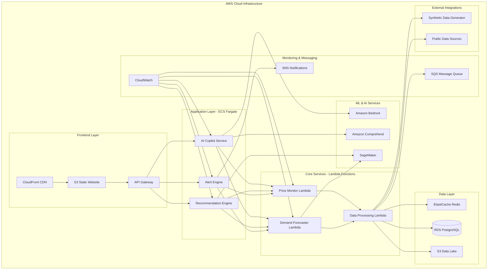

# Design Document: RetailMind AI

## Overview

RetailMind AI is designed as a modular, cloud-native platform that combines competitive intelligence, demand forecasting, and conversational AI to provide actionable business insights for small and mid-sized retailers. The system architecture emphasizes explainability, scalability, and rapid deployment suitable for hackathon environments while maintaining production-ready design principles.

The platform operates on a microservices architecture with clear separation of concerns: data ingestion and processing, machine learning inference, natural language processing, and user interface components. This design enables independent scaling, testing, and deployment of individual components while maintaining system cohesion through well-defined APIs.

## Architecture

### High-Level AWS System Architecture



### AWS Component Architecture

The system leverages AWS cloud-native services for scalability, reliability, and cost-effectiveness:

**Frontend & API Layer**:
- **CloudFront**: Global CDN for fast content delivery and caching
- **S3 Static Website**: Hosts the React-based web dashboard
- **API Gateway**: Manages REST APIs with authentication, throttling, and monitoring

**Compute Layer**:
- **ECS Fargate**: Containerized microservices for business logic (serverless containers)
- **Lambda Functions**: Event-driven compute for data processing and monitoring tasks
- **Auto Scaling**: Automatic scaling based on demand and performance metrics

**Data & Storage**:
- **RDS PostgreSQL**: Primary database for structured data with Multi-AZ deployment
- **ElastiCache Redis**: In-memory caching for fast data retrieval
- **S3 Data Lake**: Scalable storage for historical data, logs, and ML training data

**AI & Machine Learning**:
- **Amazon Bedrock**: Foundation models for natural language processing
- **SageMaker**: ML model training, hosting, and inference for demand forecasting
- **Amazon Comprehend**: Natural language understanding for query processing

**Messaging & Monitoring**:
- **SNS**: Push notifications for alerts and recommendations
- **SQS**: Asynchronous message processing for data pipelines
- **CloudWatch**: Comprehensive monitoring, logging, and alerting

## Components and Interfaces

### Price Monitor Service (AWS Lambda)

**Responsibility**: Tracks competitor pricing data from publicly available sources and synthetic data generators using serverless architecture.

**AWS Implementation**:
- **Lambda Function**: Event-driven price monitoring with scheduled CloudWatch Events
- **S3 Integration**: Store raw pricing data and historical trends
- **SQS**: Queue price monitoring tasks for parallel processing
- **CloudWatch**: Monitor function performance and set up alerts

**Key Interfaces**:
- `POST /api/v1/products/{id}/monitor` - Add product to monitoring
- `GET /api/v1/products/{id}/prices` - Retrieve price history
- `GET /api/v1/competitors/{id}/prices` - Get competitor pricing data

**Data Models**:
- Product: ID, name, category, retailer_sku, competitor_mappings
- PricePoint: product_id, competitor_id, price, timestamp, source
- Competitor: ID, name, domain, data_source_type

**Implementation Approach**:
The service uses AWS Lambda for cost-effective, event-driven price monitoring. CloudWatch Events trigger daily price collection, while SQS enables parallel processing of multiple products. Data is stored in S3 for cost-effective historical storage and RDS for real-time queries.

### Demand Forecaster Service (SageMaker + Lambda)

**Responsibility**: Generates demand predictions using AWS SageMaker for ML model training and inference.

**AWS Implementation**:
- **SageMaker**: ML model training, hosting, and batch inference
- **Lambda**: Orchestrate forecasting workflows and API endpoints
- **S3**: Store training data, model artifacts, and forecast results
- **EventBridge**: Schedule weekly forecast updates

**Key Interfaces**:
- `POST /api/v1/forecasts/generate` - Create demand forecast
- `GET /api/v1/forecasts/{product_id}` - Retrieve forecast data
- `PUT /api/v1/forecasts/{id}/feedback` - Update with actual sales data

**Data Models**:
- Forecast: product_id, period, predicted_demand, confidence_interval, created_at
- HistoricalSales: product_id, date, quantity_sold, revenue, external_factors
- ForecastAccuracy: forecast_id, actual_demand, accuracy_score, mape

**Machine Learning Approach**:
SageMaker hosts time series forecasting models using built-in algorithms (DeepAR) or custom models. The system automatically retrains models based on new data and performance metrics, with A/B testing capabilities for model comparison.

### AI Copilot Service (ECS Fargate + Bedrock)

**Responsibility**: Processes natural language queries using Amazon Bedrock and provides conversational business intelligence.

**AWS Implementation**:
- **ECS Fargate**: Containerized service for scalable NLP processing
- **Amazon Bedrock**: Foundation models for natural language understanding
- **Amazon Comprehend**: Entity extraction and sentiment analysis
- **ElastiCache**: Cache frequent queries and responses

**Key Interfaces**:
- `POST /api/v1/copilot/query` - Process natural language query
- `GET /api/v1/copilot/suggestions` - Get query suggestions
- `POST /api/v1/copilot/feedback` - Provide response feedback

**Data Models**:
- Query: user_id, query_text, intent, entities, timestamp
- Response: query_id, answer_text, confidence, data_sources, recommendations
- Intent: name, description, required_entities, response_template

**Natural Language Processing Approach**:
The copilot leverages Amazon Bedrock's foundation models for intent classification and response generation. Amazon Comprehend extracts entities (products, time periods, competitors) while custom business logic maps queries to data sources and generates contextual responses.

### Recommendation Engine (ECS Fargate + SageMaker)

**Responsibility**: Generates actionable business recommendations using ML models and business rules.

**AWS Implementation**:
- **ECS Fargate**: Containerized recommendation service
- **SageMaker**: ML models for price optimization and demand analysis
- **Lambda**: Event-driven recommendation triggers
- **SNS**: Deliver recommendations via multiple channels

**Key Interfaces**:
- `GET /api/v1/recommendations/{retailer_id}` - Get current recommendations
- `POST /api/v1/recommendations/{id}/implement` - Mark recommendation as implemented
- `GET /api/v1/recommendations/impact` - View recommendation outcomes

**Data Models**:
- Recommendation: ID, type, description, expected_impact, confidence, urgency
- RecommendationType: price_change, promotion, inventory_adjustment, bundling
- Impact: recommendation_id, actual_outcome, roi, implementation_date

**Recommendation Logic**:
The engine combines SageMaker ML models with business rules to generate recommendations. Price elasticity models inform pricing decisions, while demand forecasting drives inventory recommendations. A/B testing tracks recommendation effectiveness.

### Alert Engine (Lambda + SNS + EventBridge)

**Responsibility**: Monitors market conditions and generates proactive notifications using AWS messaging services.

**AWS Implementation**:
- **Lambda**: Process alerts and trigger notifications
- **EventBridge**: Schedule monitoring tasks and route events
- **SNS**: Multi-channel notifications (email, SMS, push)
- **CloudWatch Alarms**: System health and performance monitoring

**Key Interfaces**:
- `POST /api/v1/alerts/configure` - Set alert preferences
- `GET /api/v1/alerts/active` - Retrieve active alerts
- `PUT /api/v1/alerts/{id}/acknowledge` - Acknowledge alert

**Data Models**:
- Alert: ID, type, severity, message, trigger_conditions, created_at
- AlertRule: condition_type, threshold, notification_method, is_active
- AlertHistory: alert_id, status, acknowledged_at, resolved_at

## Data Models

### Core Data Entities

**Product Entity**:
```
Product {
  id: UUID
  name: String
  category: String
  retailer_sku: String
  cost_price: Decimal
  current_price: Decimal
  competitor_mappings: Map<CompetitorID, ProductID>
  created_at: Timestamp
  updated_at: Timestamp
}
```

**Market Intelligence Entity**:
```
MarketIntelligence {
  product_id: UUID
  competitor_prices: List<PricePoint>
  demand_forecast: ForecastData
  market_position: String
  price_elasticity: Decimal
  last_updated: Timestamp
}
```

**Business Insight Entity**:
```
BusinessInsight {
  id: UUID
  type: InsightType
  product_id: UUID
  insight_text: String
  confidence_score: Decimal
  supporting_data: JSON
  created_at: Timestamp
}
```

### Data Flow Architecture

Data flows through the AWS-based system in three primary patterns:

1. **Ingestion Flow**: External data sources → Lambda Functions → SQS → S3/RDS → ElastiCache
2. **Analysis Flow**: RDS/S3 → SageMaker → Lambda → ECS Services → API Gateway
3. **Query Flow**: User Query → CloudFront → API Gateway → ECS Copilot → Bedrock → Formatted Response

### AWS Infrastructure and Deployment

**Infrastructure as Code**:
- **AWS CDK/CloudFormation**: Define and deploy all AWS resources
- **Multi-Environment Support**: Separate dev, staging, and production environments
- **Auto Scaling**: ECS services and Lambda functions scale based on demand
- **Cost Optimization**: Use Spot instances for non-critical workloads, S3 lifecycle policies

**Security and Compliance**:
- **IAM Roles**: Least privilege access for all services
- **VPC**: Private subnets for databases and internal services
- **WAF**: Web Application Firewall for API Gateway protection
- **Secrets Manager**: Secure storage of API keys and database credentials
- **CloudTrail**: Audit logging for all AWS API calls

**Monitoring and Observability**:
- **CloudWatch**: Comprehensive metrics, logs, and alarms
- **X-Ray**: Distributed tracing for performance optimization
- **AWS Config**: Configuration compliance monitoring
- **Cost Explorer**: Track and optimize AWS spending

**Disaster Recovery**:
- **Multi-AZ RDS**: Automatic failover for database
- **S3 Cross-Region Replication**: Backup critical data
- **Lambda**: Inherently resilient across availability zones
- **CloudFormation**: Quick infrastructure recreation if needed

## Correctness Properties

*A property is a characteristic or behavior that should hold true across all valid executions of a system—essentially, a formal statement about what the system should do. Properties serve as the bridge between human-readable specifications and machine-verifiable correctness guarantees.*

Now I'll analyze the acceptance criteria to determine which can be converted into testable properties:

Based on the prework analysis, the following correctness properties have been identified and consolidated to eliminate redundancy:

### Property 1: Product Monitoring Activation
*For any* product added to the monitoring system, competitor price tracking should be automatically initiated and historical pricing trends should be stored for analysis.
**Validates: Requirements 1.1, 1.2**

### Property 2: Alert Generation and Timing
*For any* significant market condition change (competitor price drops, stockout predictions, pricing opportunities), the Alert Engine should generate appropriate notifications with recommended actions and urgency levels within specified time constraints.
**Validates: Requirements 1.3, 5.1, 5.2, 5.3, 5.5**

### Property 3: System Update Scheduling
*For any* monitored product or forecast, the system should perform regular updates (daily for prices, weekly for forecasts) when new data becomes available.
**Validates: Requirements 1.4, 2.4**

### Property 4: Data Presentation Consistency
*For any* data display request (competitor prices, forecasts, recommendations, metrics), the system should include all required information fields (current/previous values, confidence intervals, impact estimates, visual charts) in a consistent format.
**Validates: Requirements 1.5, 2.3, 4.2, 5.5, 7.2**

### Property 5: Demand Forecasting Accuracy
*For any* historical sales data input, the Demand Forecaster should generate 30-day predictions that incorporate seasonal trends and historical patterns, and measure accuracy when actual data becomes available.
**Validates: Requirements 2.1, 2.2, 2.5**

### Property 6: Natural Language Query Processing
*For any* natural language business query, the AI Copilot should interpret the query and provide relevant insights with data sources and reasoning, or suggest alternatives if the query cannot be answered.
**Validates: Requirements 3.1, 3.2, 3.3**

### Property 7: Query Scope Support
*For any* query about pricing, inventory, competitors, or demand trends, the AI Copilot should be able to process and respond appropriately.
**Validates: Requirements 3.4**

### Property 8: Comprehensive Recommendation Generation
*For any* market condition change, the system should generate specific action recommendations (price changes, promotions, bundling, inventory adjustments) with expected impact, confidence level, reasoning, and supporting data.
**Validates: Requirements 4.1, 4.2, 4.3, 4.4**

### Property 9: Recommendation Outcome Tracking
*For any* implemented recommendation, the system should track the outcome and measure effectiveness over time.
**Validates: Requirements 4.5**

### Property 10: Alert Customization
*For any* retailer, the Alert Engine should allow customization of alert thresholds and preferences according to their business needs.
**Validates: Requirements 5.4**

### Property 11: Data Source Flexibility
*For any* data processing operation, the system should support both real and synthetic data sources, clearly indicate data source types, and generate realistic patterns when using synthetic data.
**Validates: Requirements 6.1, 6.2, 6.3**

### Property 12: Data Validation and Quality
*For any* data input or configuration, the system should validate data quality, completeness, and setup integrity before processing or confirming completion.
**Validates: Requirements 6.4, 8.4**

### Property 13: Dashboard and Login Behavior
*For any* retailer login, the system should display a comprehensive business dashboard with key performance indicators and visual representations.
**Validates: Requirements 7.1, 7.2**

### Property 14: Report Functionality
*For any* report generation request, the system should provide filtering, time-range selection, competitor comparisons, market trends, and export capabilities in common formats (PDF, CSV).
**Validates: Requirements 7.3, 7.4, 7.5**

### Property 15: System Configuration and Setup
*For any* system setup process, the system should guide retailers through product catalog configuration, automatically identify competitors, allow customization of business rules, and support bulk import from common formats.
**Validates: Requirements 8.1, 8.2, 8.3, 8.5**

## Error Handling

### Data Quality and Validation Errors

The system implements comprehensive error handling for data quality issues:

- **Invalid Data Formats**: When synthetic or public data sources provide malformed data, the system logs the error, attempts data cleaning, and falls back to cached historical data
- **Missing Data Points**: For incomplete competitor pricing or sales data, the system uses interpolation techniques and clearly marks estimated values
- **Data Source Failures**: When external data sources are unavailable, the system continues operating with cached data and notifies users of potential staleness

### Machine Learning Model Errors

- **Forecast Confidence Thresholds**: When demand forecasting models produce predictions with confidence below acceptable thresholds, the system provides wider confidence intervals and recommends conservative inventory decisions
- **Model Drift Detection**: The system monitors forecast accuracy over time and triggers model retraining when performance degrades beyond acceptable limits
- **Fallback Predictions**: When ML models fail, the system falls back to simple statistical methods (moving averages, seasonal decomposition) to maintain service availability

### Natural Language Processing Errors

- **Query Ambiguity**: When the AI Copilot cannot determine user intent with sufficient confidence, it requests clarification with suggested alternative phrasings
- **Unsupported Query Types**: For queries outside the supported business domains, the system provides helpful error messages and suggests related queries it can handle
- **Context Loss**: When conversational context becomes unclear, the system resets the conversation and asks users to rephrase their questions

### System Integration Errors

- **API Failures**: All external API calls implement retry logic with exponential backoff and circuit breaker patterns
- **Database Connectivity**: The system maintains connection pools and implements automatic failover to read replicas during primary database issues
- **Cache Invalidation**: When cache inconsistencies are detected, the system automatically refreshes affected data and logs the incident for analysis

## Testing Strategy

### Dual Testing Approach

The RetailMind AI system employs both unit testing and property-based testing to ensure comprehensive coverage and correctness validation:

**Unit Tests** focus on:
- Specific business logic examples with known inputs and expected outputs
- Edge cases such as empty datasets, extreme values, and boundary conditions
- Integration points between services and external APIs
- Error handling scenarios and recovery mechanisms

**Property-Based Tests** focus on:
- Universal properties that must hold across all valid inputs
- Comprehensive input coverage through randomized test data generation
- Correctness properties derived from business requirements
- System behavior validation across diverse scenarios

### Property-Based Testing Configuration

The system uses **Hypothesis** (Python) for property-based testing with the following configuration:
- **Minimum 100 iterations** per property test to ensure statistical confidence
- **Custom data generators** for realistic retail scenarios (products, prices, sales data)
- **Shrinking strategies** to identify minimal failing examples when properties are violated
- **Test tagging** format: **Feature: retailmind-ai, Property {number}: {property_text}**

Each correctness property listed above will be implemented as a separate property-based test, ensuring that the system behavior aligns with business requirements across all possible inputs.

### Testing Data Strategy

For hackathon feasibility, the testing strategy emphasizes synthetic data generation:
- **Realistic Market Scenarios**: Generate synthetic competitor pricing data with realistic market dynamics
- **Seasonal Sales Patterns**: Create historical sales data with seasonal trends and noise
- **Edge Case Generation**: Automatically generate edge cases like price wars, stockouts, and demand spikes
- **Performance Testing**: Use synthetic load testing to validate system scalability

### Integration Testing

- **End-to-End Workflows**: Test complete user journeys from product setup to recommendation implementation
- **API Contract Testing**: Validate all service interfaces maintain backward compatibility
- **Data Pipeline Testing**: Ensure data flows correctly through ingestion, processing, and presentation layers
- **Alert System Testing**: Verify alert generation, delivery, and acknowledgment workflows

The testing strategy ensures that RetailMind AI delivers reliable, accurate insights while maintaining system performance and user experience quality standards suitable for production deployment beyond the hackathon environment.